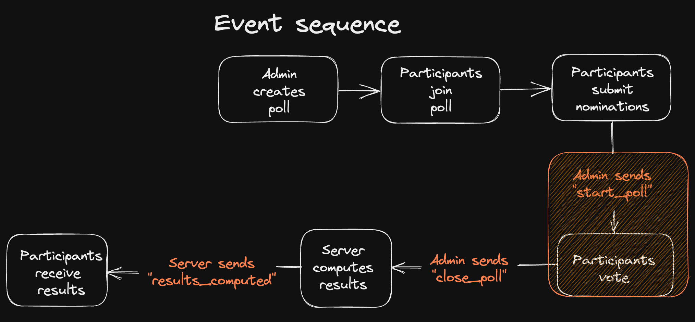

## Logic

## Voting method

[Instant-runoff voting (IRV)](https://en.wikipedia.org/wiki/Instant-runoff_voting) is a type of ranked preferential voting method. It uses a majority voting rule in single-member districts in which there are more than two candidates.

Voters in IRV elections rank the candidates in order of preference. Ballots are initially counted to establish the number of votes for each candidate. If a candidate has more than half of the first-choice votes, that candidate wins. If not, then the candidate with the fewest votes is eliminated, and the voters who selected that candidate as their first choice have their votes added to the total of the candidate who was their next choice. That process continues until one candidate has more than half of the votes, and that person is declared the winner. IRV is not a proportional voting system but a "winner-takes-all" method, because it results in only one winner in one district.
